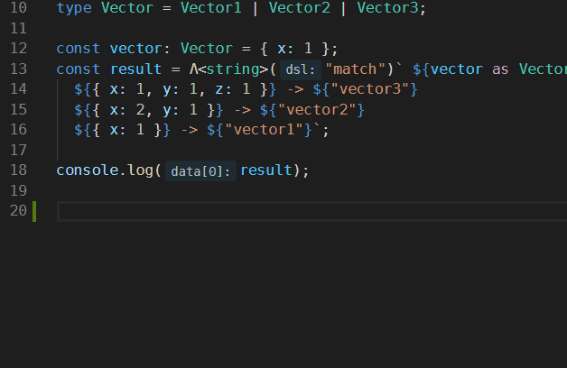

# DSL Match &middot;  [](https://coveralls.io/github/mistlog/draft-dsl-match)

DSL Match is used in typedraft to support pattern match.

## Inspirations

This DSL is inspired by [ts-pattern](https://github.com/gvergnaud/ts-pattern) and [tc39/proposal-pattern-matching](https://github.com/tc39/proposal-pattern-matching). Examples and test cases are adapted from [ts-pattern](https://github.com/gvergnaud/ts-pattern).

## Installation

Suppose that you have `typedraft` installed, then:

```shell
npm i -D draft-dsl-match
```

and add it to `typedraft.config.ts`:

```ts
import { PatternMatch } from "draft-dsl-match";

export default {
    DSLs: [{ name: "match", dsl: () => new PatternMatch() }],
};
```

You can use [dsl-match-demo](https://github.com/mistlog/dsl-match-demo) as template project to get started quickly.

## Examples

### Data Structure

Support objects, arrays, tuples, Sets, Maps, and all primitive types.

#### Object

```ts
import { MatchDSL } from "draft-dsl-match";

type Vector1 = { x: number };
type Vector2 = { x: number; y: number };
type Vector3 = {
    x: number;
    y: number;
    z: number;
};
type Vector = Vector1 | Vector2 | Vector3;

const vector: Vector = { x: 1 };
const result = Λ<string>("match")` ${vector as Vector} 
    ${{ x: 1, y: 1, z: 1 }} -> ${"vector3"}
    ${{ x: 2, y: 1 }} -> ${"vector2"}
    ${{ x: 1 }} -> ${"vector1"}
`;

console.log(result); // "vector1"
```

In this example, `import { MatchDSL } from "draft-dsl-match"` is necessary even `MatchDSL` is not used because `Λ` will be translated to `MatchDSL`.

`Λ` is unicode [U+039B](https://www.compart.com/en/unicode/U+039B), it resembles caret and is used to introduce a new context where you can apply a DSL, and `<string>` is used to assert the output type.

"match" is the name of the DSL. You can customize it in `typedraft.config.ts`.

The syntax is straightforward, you put whatever you want to match in the first `${}`, and the `${}` at the left of `->` is pattern you want to match, the `${}` at the right is handler, putting values here implies `() => { return <values>; }`

It's hard to type `Λ`, thus we recommend that you can create [code snippet](https://code.visualstudio.com/docs/editor/userdefinedsnippets) in vscode so that you can type it in this way:



The snippet you may want to reuse:

```js
{
    "dsl": {
        "scope": "javascript,typescript,typescriptreact",
        "prefix": "dsl",
        "body": ["Λ('$1')` $2`"],
        "description": "use dsl in typedraft"
    }
}
```

#### Array

```ts
import { MatchDSL, String, __ } from "draft-dsl-match";

type Input = { title: string; content: string }[];

let input: Input = [
    { title: "Hello world!", content: "I‘m a very interesting content" },
    { title: "Bonjour!", content: "I‘m a very interesting content too" },
];

const result = Λ("match")` ${input}
  ${[{ title: String, content: String }]} -> ${"a list of posts!"}
  ${__} -> ${"something else"}
`;

console.log(result); // "a list of posts!"
```

`__` will match any value, and `String` is used to denote the `String` type.

#### Tuple

```ts
import { MatchDSL, Number } from "draft-dsl-match";

const sum = (args: number[]): number => Λ<number>("match")` ${args} 
    ${[]} -> ${0}
    ${[Number, Number]} -> ${([x, y]) => x + y}
    ${[Number, Number, Number]} -> ${([x, y, z]) => x + y + z}
    ${[Number, Number, Number, Number]} -> ${([x, y, z, w]) => x + y + z + w}
`;

const result = sum([2, 3, 2, 4]);
console.log(result); // 11
```

Then we can have function overloading in this way:

```ts
import { MatchDSL, Number, String, __ } from "draft-dsl-match";

type ArgsType = [string, string] | [number, number] | [any, any];
type RetrunType = number | string | any;

const add = (args: ArgsType): RetrunType => Λ<RetrunType>("match")` ${args as ArgsType} 
    ${[String, String]} -> ${args => args.join(" ")}
    ${[Number, Number]} -> ${([x, y]) => x + y}
    ${[__, __]} -> ${args => `the sum is args.join("-"): ${args.join("-")}`}
`;

console.log(add(["hello", "world"]));
console.log(add([1, 2]));
console.log(add(["hi", 1]));

// hello world
// 3
// the sum is args.join("-"): hi-1
```

#### Sets and Maps

```ts
import { MatchDSL, __ } from "draft-dsl-match";

const ContainsGabAndYo = (set: Set<string | number>) => Λ<[boolean, boolean]>("match")` ${set}
    ${new Set(["gab", "yo"])} -> ${[true, true]}
    ${new Set(["gab"])} -> ${[true, false]}
    ${new Set(["yo"])} -> ${[false, true]}
    ${__} -> ${[false, false]}
`;

console.log(ContainsGabAndYo(new Set(["gab", "yo", "hello"])));
console.log(ContainsGabAndYo(new Set(["gab", "hello"])));
console.log(ContainsGabAndYo(new Set(["yo", "hello"])));
console.log(ContainsGabAndYo(new Set(["hello"])));
console.log(ContainsGabAndYo(new Set([])));
console.log(ContainsGabAndYo(new Set([2])));

// [ true, true ]
// [ true, false ]
// [ false, true ]
// [ false, false ]
// [ false, false ]
// [ false, false ]
```

```ts
import { MatchDSL, String, __ } from "draft-dsl-match";

const users_map = new Map([
    ["gab", { name: "gabriel" }],
    ["angégé", { name: "angéline" }],
]);

const user_pattern = { name: String };

const result = Λ("match")` ${users_map as Map<string, { name: string }>}
    ${new Map([
        ["angégé", user_pattern],
        ["gab", user_pattern],
    ])} -> ${map => ({ name: map.get("angégé")!.name + " " + map.get("gab")!.name })}
    ${new Map([["angégé", user_pattern]])} -> ${map => map.get("angégé")}
    ${new Map([["gab", user_pattern]])} -> ${map => map.get("gab")}
    ${__} -> ${{ name: "unknown" }}
`;

console.log(result); // { name: 'angéline gabriel' }
```

### Predicate

Predicate can also be used at the left side of `->`:

```ts
import { MatchDSL, __ } from "draft-dsl-match";

const values = [
    { value: 1, expected: false },
    { value: -2, expected: false },
    { value: 3, expected: false },
    { value: 100, expected: false },
    { value: 20, expected: true },
    { value: 39, expected: true },
];

values.forEach(({ value, expected }) => {
    const result = Λ<boolean>("match")` ${value}
        ${(x: number) => x > 10 && x < 50} -> ${true}
        ${__} -> ${false}
    `;
    console.log(result === expected);
});

// true
// true
// true
// true
// true
// true
```

### Properties selection

You can use matched value in this way:

```ts
import { MatchDSL, __, use } from "draft-dsl-match";

const y = Λ("match")` ${["get", 2]}
    ${["get", use("y")]} -> ${(_, { y }) => y}
`;

console.log(y); // 2
```

The second param of handler is an object that contains values you want to "use".

## License

DSL Match is [MIT licensed](https://github.com/mistlog/draft-dsl-match/blob/master/LICENSE).
